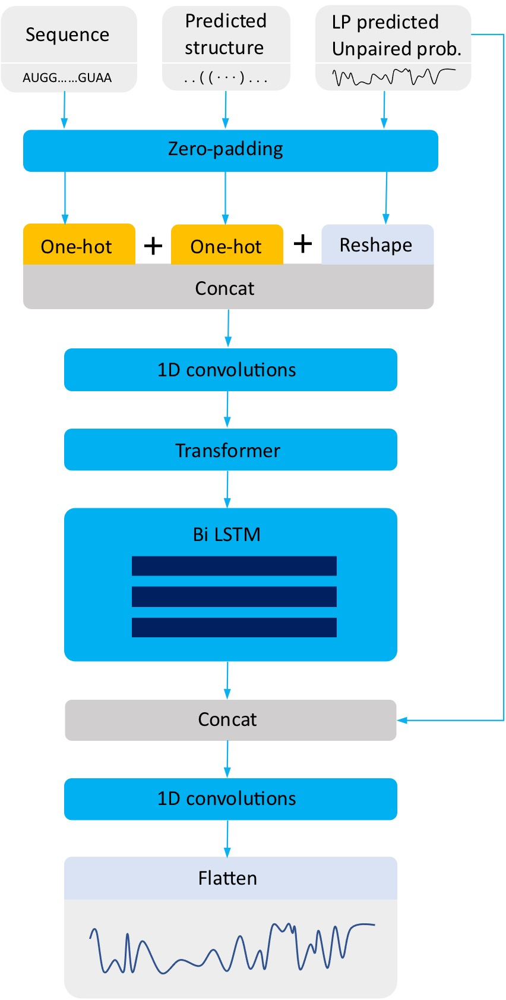

# 螺旋桨RNA结构预测竞赛第2名方案

## 赛题理解

赛题是根据RNA的一级结构和预测的二级结构来构建模型预测RNA各个碱基的未配对概率。

RNA序列由四种碱基组成，分别是腺嘌呤，胞嘧啶，鸟嘌呤和尿嘧啶。这四种碱基组成的序列就是RNA序列，也叫做**RNA的一级结构**。我们把2D平面上由**碱基配对**形成的结构称之为**RNA的二级结构**，并且用点括号表示法——使用点“.”，和成对的括号，即“(”和“)”，组成的序列来表示其二级结构。

预测碱基未配对概率，可以理解为：预测RNA序列中各碱基对应位置上的二级结构有多大概率是“.”。预测结果是一个一维的由范围在0~1之间数字组成的序列。

可见，这在深度学习中是一种典型的N-N的seq2seq问题。

## 思路分享

### Word-embedding or One-hot

首先需要解决的是输入序列的编码问题。我们想到word-embedding和one-hot方法。我们都进行尝试后发现，使用one-hot方法进行编码时，预测得到的结果要好于word-embedding。

在NLP任务中，字词编码的词表非常大，导致维度多且稀疏，所以需要word-embedding得到词语的低维稠密表示。这样做的好处是，不同字词间有很大的联系，而这一联系可以通过词向量间的cos距离等来刻画。而RNA碱基种类少，只有4种，只需要一个4维的one-hot向量就可以表示。而且，不同碱基间的关联度小，差异性才是更重要的特点。Onehot向量可以充分表达差异性，因为不同onehot向量在高维空间中相互垂直。

### K-mers with 1D convolutions

NLP任务中，有时会用到的一种叫做n-gram的技术，即将多个词绑定为一个整体。这个技术在蛋白质序列、DNA序列以及基因组相关的研究中也常常使用，称为k-mers。参考论文《Nucleic Transformer: Deep Learning on Nucleic Acids with Self-Attention and Convolutions》[1]，我们将一维卷积和k-mers结合起来，通过CNN捕获局部信息，并使其具有生物学意义。使用k-mers构建词表时，假设k=5，那么词表的大小就是4^5=1024。这种处理，相当于在编码时将一定范围内的上下文也考虑了进去，增加了词的多样性，可以一定程度上提高模型的学习能力。

经过调试，k-mers长度为9，即使用9-mer时，预测效果最好。

### Transformer encoder

Transformer中multi-head允许不同的头学习输入的不同的隐藏层表示，可以提高预测性能。此外，self-attention机制允许我们先前构造的每个k-mer都注意到所有的k-mer，很好地解决序列内长距离的依赖问题。

### Bi LSTM

我们在尝试了仅使用transformer、仅使用Bi LSTM，和同时使用transformer和Bi LSTM。我们发现同时使用transformer和bi LSTM，且bi LSTM层数为3时，预测效果最好。

### 20-Fold Cross Validation 

由于数据集较小，为了确定最适合的超参数，我们使用了20折交叉验证。

### 其他调参

我们对bp_cutoff等 参数进行了调整，以得到预测效果最好的数值。

### 思路架构图

[1] He S, Gao B, Sabnis R, et al. NUCLEIC TRANSFORMER: DEEP LEARNING ON NUCLEIC ACIDS WITH SELF-ATTENTION AND CONVOLUTIONS[J]. bioRxiv, 2021.